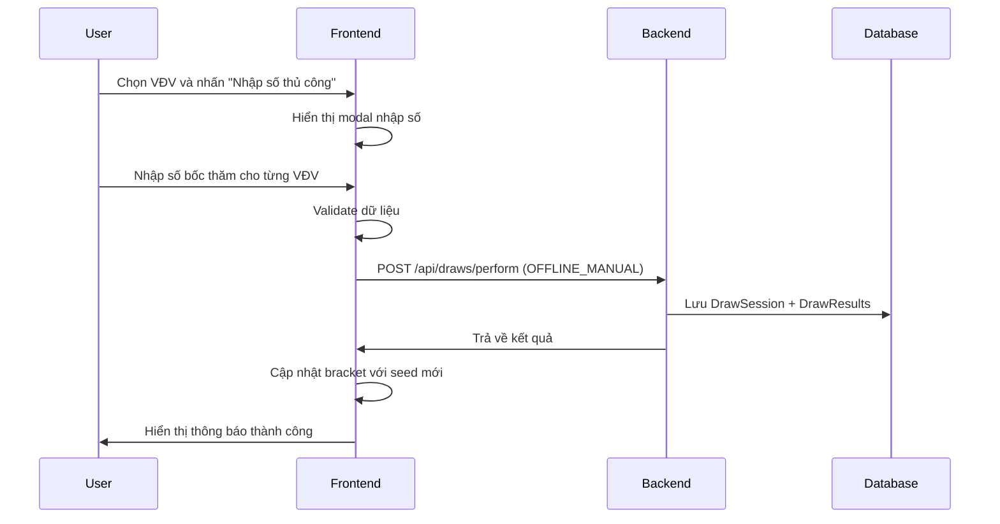
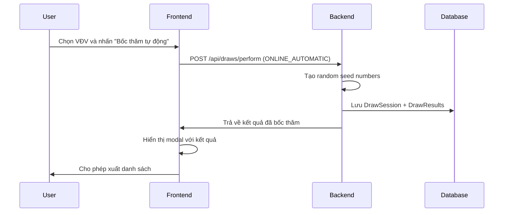

# 🎯 Hệ thống Bốc thăm Vovinam - Architecture Overview

## 📋 Tổng quan

Hệ thống quản lý bốc thăm cho giải đấu Vovinam được thiết kế để hỗ trợ cả hai luồng:
- **Offline Draw**: Bốc thăm thủ công, nhập số vào hệ thống
- **Online Draw**: Bốc thăm tự động bằng thuật toán

## 🏗️ Kiến trúc hệ thống

### Backend Components

#### 1. Entities
```
DrawSession
├── id (UUID)
├── competitionId
├── weightClassId  
├── drawType (OFFLINE_MANUAL | ONLINE_AUTOMATIC)
├── drawnBy (User ID)
├── drawDate
├── isFinal (Boolean)
├── notes
└── audit fields (createdBy, createdAt)

DrawResult
├── id (UUID)
├── drawSessionId (FK)
├── athleteId
├── seedNumber
├── athleteName
├── athleteClub
└── audit fields
```

#### 2. Services
- **DrawService**: Core business logic
  - `performDraw()`: Thực hiện bốc thăm
  - `performAutomaticDraw()`: Bốc thăm tự động
  - `performManualDraw()`: Bốc thăm thủ công
  - `getDrawHistory()`: Lịch sử bốc thăm
  - `finalizeDraw()`: Xác nhận kết quả cuối

#### 3. APIs
```
POST /api/draws/perform
GET  /api/draws/history/{competitionId}/{weightClassId}
GET  /api/draws/final/{competitionId}/{weightClassId}
POST /api/draws/finalize/{drawSessionId}
```

### Frontend Components

#### 1. BracketBuilder.tsx
- **UI Controls**:
  - 🎲 Bốc thăm tự động (Online)
  - ✏️ Nhập số thủ công (Offline)
  - 📋 Lịch sử bốc thăm

#### 2. Modals
- **Online Draw Modal**: Hiển thị kết quả bốc thăm tự động
- **Manual Draw Modal**: Form nhập số bốc thăm thủ công
- **Draw History Modal**: Lịch sử các lần bốc thăm

#### 3. Services
- **drawService.ts**: API client cho draw operations

## 🔄 Luồng nghiệp vụ

### Case 1: Bốc thăm Offline (Manual)



### Case 2: Bốc thăm Online (Automatic)



## 🛡️ Tính năng bảo mật & Audit

### 1. Audit Logging
- **User tracking**: Ghi lại ai thực hiện bốc thăm
- **Timestamp**: Thời gian chính xác
- **Draw type**: Phân biệt offline/online
- **Session ID**: Theo dõi từng phiên bốc thăm

### 2. Data Integrity
- **Validation**: Kiểm tra số bốc thăm không trùng lặp
- **Range check**: Số bốc thăm từ 1 đến N
- **Finalization**: Xác nhận kết quả cuối cùng

### 3. History Management
- **Multiple draws**: Cho phép nhiều lần bốc thăm
- **Version control**: Theo dõi các phiên bản
- **Final draw**: Đánh dấu kết quả chính thức

## 🎨 UI/UX Features

### 1. Visual Indicators
- 🎲 **Online Draw**: Màu xanh dương, icon dice
- ✏️ **Manual Draw**: Màu cam, icon pencil
- 📋 **History**: Màu tím, icon clipboard

### 2. User Experience
- **Clear labeling**: Phân biệt rõ ràng 2 loại bốc thăm
- **Validation feedback**: Thông báo lỗi chi tiết
- **Export functionality**: Xuất danh sách bốc thăm
- **History tracking**: Xem lại các lần bốc thăm

### 3. Responsive Design
- **Mobile-friendly**: Hoạt động tốt trên mobile
- **Modal system**: Không làm gián đoạn workflow
- **Loading states**: Feedback khi đang xử lý

## 🔧 Technical Implementation

### Backend Stack
- **Java Spring Boot**: REST API
- **JPA/Hibernate**: ORM
- **MySQL**: Database
- **UUID**: Primary keys

### Frontend Stack
- **React + TypeScript**: UI framework
- **Tailwind CSS**: Styling
- **Axios**: HTTP client
- **React Hooks**: State management

### Database Schema
```sql
-- Draw Sessions
CREATE TABLE draw_sessions (
    id VARCHAR(36) PRIMARY KEY,
    competition_id VARCHAR(36) NOT NULL,
    weight_class_id VARCHAR(36) NOT NULL,
    draw_type VARCHAR(20) NOT NULL,
    drawn_by VARCHAR(36) NOT NULL,
    draw_date TIMESTAMP NOT NULL,
    is_final BOOLEAN NOT NULL DEFAULT FALSE,
    notes TEXT,
    created_by VARCHAR(36) NOT NULL,
    created_at TIMESTAMP NOT NULL DEFAULT CURRENT_TIMESTAMP
);

-- Draw Results
CREATE TABLE draw_results (
    id VARCHAR(36) PRIMARY KEY,
    draw_session_id VARCHAR(36) NOT NULL,
    athlete_id VARCHAR(36) NOT NULL,
    seed_number INT NOT NULL,
    athlete_name VARCHAR(200) NOT NULL,
    athlete_club VARCHAR(200),
    created_at TIMESTAMP NOT NULL DEFAULT CURRENT_TIMESTAMP,
    FOREIGN KEY (draw_session_id) REFERENCES draw_sessions(id)
);
```

## 🚀 Deployment & Migration

### Database Migration
- **V11__Create_draw_tables.sql**: Tạo bảng mới
- **Backward compatible**: Không ảnh hưởng dữ liệu cũ
- **Indexes**: Tối ưu performance

### API Versioning
- **v1 endpoints**: Sử dụng versioning
- **Backward compatibility**: Đảm bảo tương thích
- **Documentation**: Swagger/OpenAPI

## 📊 Monitoring & Analytics

### 1. Performance Metrics
- **Draw completion time**: Thời gian hoàn thành bốc thăm
- **API response time**: Thời gian phản hồi API
- **Error rates**: Tỷ lệ lỗi

### 2. Business Metrics
- **Draw frequency**: Tần suất bốc thăm
- **User adoption**: Mức độ sử dụng
- **Offline vs Online**: Tỷ lệ sử dụng 2 loại

## 🔮 Future Enhancements

### 1. Advanced Features
- **Video recording**: Quay video bốc thăm offline
- **Live streaming**: Phát trực tiếp bốc thăm
- **Mobile app**: Ứng dụng mobile riêng

### 2. Integration
- **Social media**: Chia sẻ kết quả
- **Notifications**: Thông báo real-time
- **Analytics dashboard**: Bảng điều khiển thống kê

---

## 🎯 Kết luận

Hệ thống bốc thăm Vovinam được thiết kế để:
- ✅ **Linh hoạt**: Hỗ trợ cả offline và online
- ✅ **Minh bạch**: Audit trail đầy đủ
- ✅ **Dễ sử dụng**: UI/UX thân thiện
- ✅ **Mở rộng**: Kiến trúc scalable
- ✅ **Bảo mật**: Tuân thủ best practices

Đây là một giải pháp hoàn chỉnh cho việc quản lý bốc thăm trong giải đấu Vovinam, đáp ứng được yêu cầu của mentor về tính minh bạch và công bằng.
